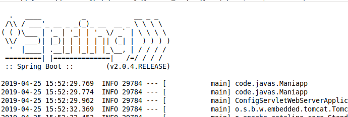
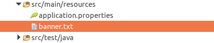
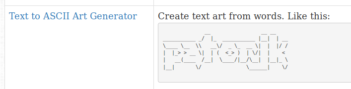
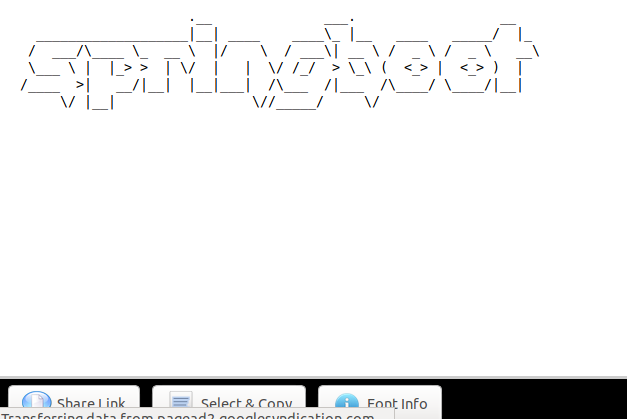

#### 默认情况下的 banner 提示文本

在默认的情况下,启动 springboot 的启动类后,在控制台的首行会输出默认样式的 banner.(banner 中文释义标题.).如下所示 :  
  
springboot 是支持定制化启动时的 banner 提示的.

#### 定制化 banner 的步骤

(1)  
需要在`src/main/resources`的目录下创建名为`banner.txt`的文件,需要注意的时,此文件的名称以及位置必须要按照规定设定,否则定制化 banner 就会失效.如下所示 :  
  
(2)  
定制 banner 的标题文件,此处推荐一个网站,即`http://patorjk.com/`,进入该网站的主页后,进入自动生成艺术文本符号字体的项目中.如下所示 :  
  
输入需要生成的符号字体,目前只支持英文字母.自动生成后点击`select&copy`按钮,将自动生成的符号字体拷贝到粘贴板上.如下所示 :  
  
(3)  
打开创建的`banner.txt`文件,粘贴保存,然后重新启动 springboot 的启动类即生效.如下所示 :  

