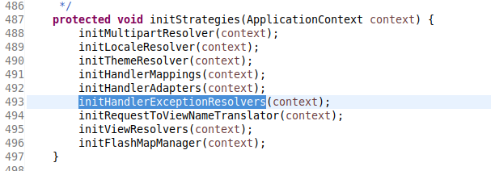
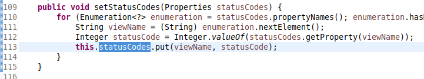

> 要点结构图

> 核心要点

- 顶层接口
  `org.springframework.web.servlet.DispatcherServlet.initStrategies(ApplicationContext)`追踪此方法可确定异常处理的顶层接口就是`HandlerExcepetionResolver`.  
    
    
  
- 配置标签`<mvc:annotation-driven/>`
  - 使用时,加载的组件.
    - `AnnotationMethodHandlerExceptionResolver`
    - `ResponseStatusExceptionResolver`
    - `DefaultHandlerExceptionResolver`
  - 不适用时,加载的组件.
    - `ExceptionHandlerExceptionResolver`  
      从 spring3.2 开始,此组件就替代了`AnnotationMethodHandlerExceptionResolver`被弃用的组件.
    - `ResponseStatusExceptionResolver`
    - `DefaultHandlerExceptionResolver`
  - 不适用时,但手动注册了`SimpleMappingExceptionResolver`.
    - `DispatcherServlet` 定制的默认异常处理组件都不会被注册
    - 只会注册 `SimpleMappingExceptionResolver` 组件
- 优先级接口`org.springframework.core.Ordered`
  - 适用于存在多种异常处理配置时的场景
  - 定制各个异常处理组件的优先级高低

> 常见的异常处理组件

- `ExceptionHandlerExceptionResolver`  
  处理基于`java.lang.Exception`子类异常的组件.
- `ResponseStatusExceptionResolver`  
  处理基于 HTTP 状态码的异常组件.
- `DefaultHandlerExceptionResolver`  
  处理基于 spring 内置异常类的组件.
- `SimpleMappingExceptionResolver`(推荐重点掌握)  
  统一处理 springmvc 中的异常,包括 Exception 子类和 HTTP 状态码的组件类.

> @ExceptionHandler 的使用

1. 配置文件中添加注解扫描驱动标签.
   
1. 两种方式使用`@ExceptionHandler`注解.  
   一种是结合`@Controller`注解一起使用  
     
   一种是结合`@ControllerAdvice`注解一起使用  
   
1. 创建对应异常处理提示信息的错误 jsp 页面.

> @ResponseStatus 的使用

1. 配置文件中添加注解扫描驱动标签.
   
1. 两种方式使用`@ResponseStatus`注解.  
   一种是在自定义的异常类上使用.  
   
   一种是结合`handler`处理方法一起使用.  
   (值得注意的是,这个自定义异常类是不需要使用 bean 组件注册的注解的.如`@Component`)  
   
1. 无需设置错误页面,会在状态码提示中,显式定制的异常提示信息.

> DefaultHandlerExceptionResolver 的说明

当系统抛出 spring 内置的异常类时,会默认调用此`DefaultHandlerExceptionResolver`来处理 spring 内置的异常.可查看该类源码中的`doResolveException()`方法来确定有哪些内置的异常类.  
  
采用如下的方式可简单的测试.  

> SimpleMappingExceptionResolver 的使用

#####组件说明

- 此组件可统一处理 spring 中出现的各种异常.
- 使用此组件的方式推荐使用 xml 的配置方式.
- 处理基于`java.lang.Exception`子类异常的时候,配置其属性`exceptionMappings`.  
  
- 处理 HTTP 状态码异常的时候,配置其属性`statusCodes`.  
  
- 排除拦截指定异常类型的时候,配置其属性`excludedExceptions`.  
  
- 设置默认的错误转发页面的时候,配置其属性`defaultErrorView`.  
  

#####使用方式

1. 切记配置标签`<mvc:annotation-driven/>`.
1. 手动注册组件`SimpleMappingExceptionResolver`.

