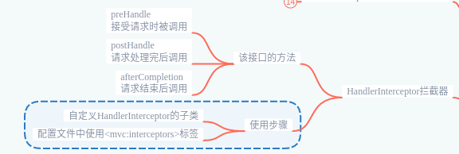
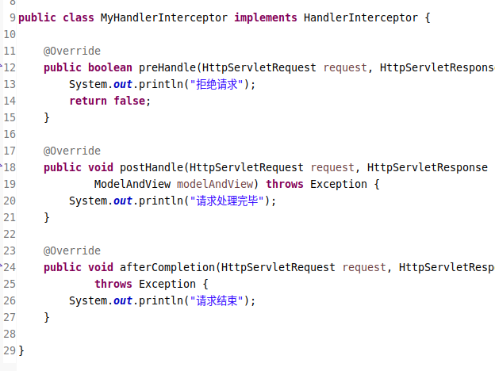
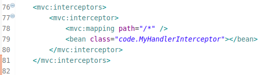

> 结构图

> `HandlerInterceptor` 接口

- `org.springframework.web.servlet.HandlerInterceptor`
- `preHandle` : 在接收到指定请求时,被调用;返回 true,同意处理请求;返回 false,拒绝处理请求.
- `postHandle` : 在当前请求被处理之后,也就是 controller 的 handler 方法执行完后,执行此方法.
- `afterCompletion` : 当前请求结束之后被调用.

> `<mvc:interceptor>`标签

- 注册的拦截器必须实现 `HandlerInterceptor` 或者是 `WebRequestInterceptor` 接口.
- 关于拦截器的顺序,按照配置文件中排列的先后顺序注册.
- 关于配置拦截的方式,有两种方式.
  - 一种是直接在此元素内,配置 `bean` 或者 `ref` 元素,这些拦截器会拦截所有 handler mapping 中的映射请求.
  - 一种是在此元素内,进一步的配置 `interceptor` 元素,这些拦截器会根据定义的映射 `uri`,进行拦截请求处理.
- 子标签说明.
  - `<mvc:mapping path="" />`配置需要拦截的路径.
  - `<mvc:exclude-mapping path="" />`排除不需要拦截的路径.

> 使用方式

1. 实现指定的接口,`HandlerInterceptor`接口.  
   
1. 配置文件中,配置拦截器标签.  
   
1. 测试即可.
