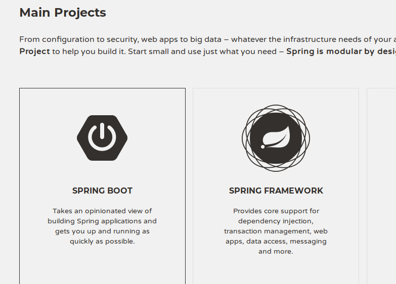
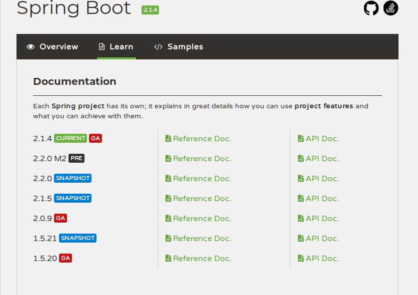
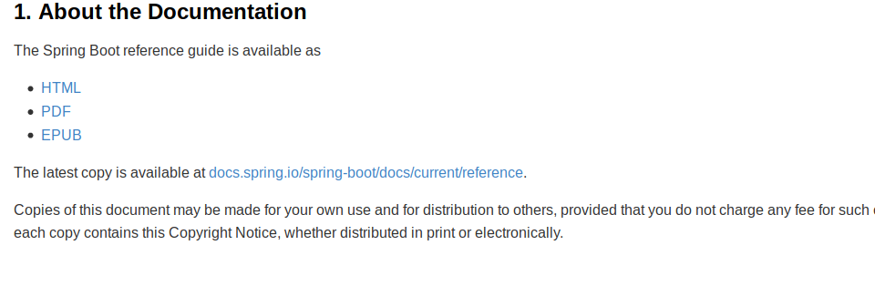
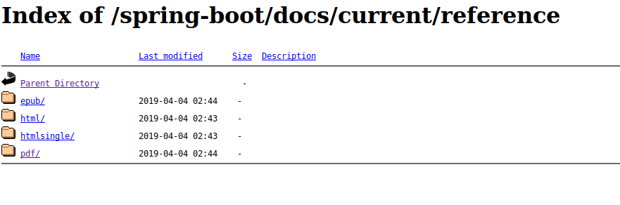
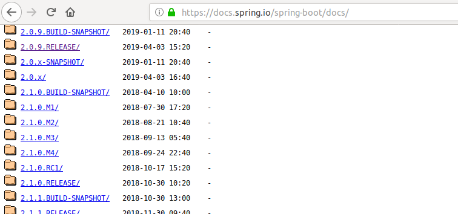
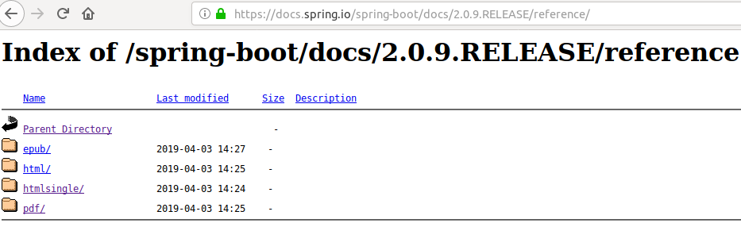
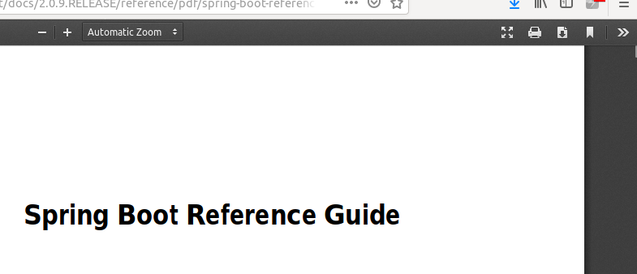
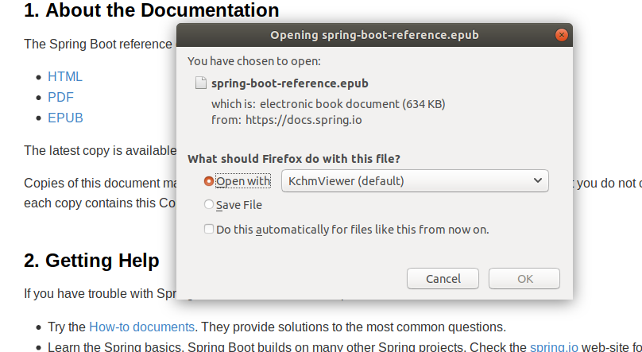

#### 如何下载 springboot 的官方文档

(1)  
首先进入 spring 的官方主页`https://spring.io/`,然后点击进入`project`选项栏,在新的页面中,点击进入`spring boot`项目中.  
(2)  
  
(3)  
新页面是 springboot 的概览视图,首先会出现全局概述的说明文档,有兴趣的可以看看,点击`learn`选项卡,选择稳定版本的 springboot,然后查看在线的官方入门文档.根据此时的显示,推荐选择 2.0.9 的版本.然后点击`reference doc`这个链接.  
  
(4)  
在文档目录中,点击`about the document`的目录跳转.可看到有这么一句话`The latest copy is available at docs.spring.io/spring-boot/docs/current/reference.`,简单翻译就是,这个链接里有最新的官方文档说明可有下载到本地.那就点击进去这个链接 : ``  
  
(5)  
出现的下载链接是最新版本的,而不是需要的 2.0.9 版本的.  
  
(6)  
怎么办?查看当前的链接地址为`https://docs.spring.io/spring-boot/docs/current/reference/`,注意中间的目录级别`current`,估摸意思就是当前版本的 doc.(补充,像浏览器显示的这种页面,一般都是搭建的 ftp 文件共享服务器的访问页面.).  
确认了这点,就点击上级目录`parent directory`两次,直接跳转到`doc`目录中,然后找到需要的 2.0.9 的版本.  
注意,应当选择`2.0.9.release`的目录.  
  
(7)  
点击进去,然后选择`reference`目录,就可以看到文档下载类型的选择了.一般 pc 端使用的话,下载 pdf 的文件;移动端使用的话,推荐下载 epub 的文件.  
  
(8)  
这里我下载的是 pdf 的,然后使用浏览器打开,在出现的在线的文档转码解析后的页面中,我的 firefox 是在右上角有个下载的按钮,点击就可下载该文档了.  

#### 快捷小提示

在上述步骤的第(2)步中,查看的是 spring 官网上的在线文档.在`about the document`章节的内容中,若是想下载 pdf,html,epub 的文件,直接点击上面的文件类型,浏览器就会自动跳转下载提示的对话框的.(上面的方式虽然步骤麻烦,但是可以选择官方发布的任意版本的官方文档的.而这种快捷的方式,只能下载官网推荐版本的参考文档的.)  

