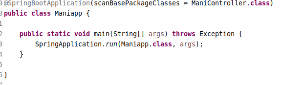

#### 核心的注解和核心的类

在 springboot 中,容器的启动方式,是有区别于传统框架的.一般在启动 springboot 的时候,需要创建一个`main`方法,并且在该方法的类上使用注解`@SpringBootApplication`进行自动化配置标记.  
这样的类,被称作 springboot 的`启动类`.  
一个启动类,通常是如下的形式 :  

#### @SpringBootApplication 的作用

此注解标记的类,就是 springboot 程序的入口类.它表示这个类,就是 springboot 应用程序的启动类.在启动类的内部,通常创建一个`main`方法,在`main`方法中通常调用`SpringBootApplication`的静态方法`run`来启动容器.

#### 核心注解的拆分

`@SpringBootApplication`注解是个组合注解,直接查看其源码可知,这个注解是由以下三个注解组成的.

- @SpringBootConfiguration
- @EnableAutoConfiguration
- @ComponentScan

> @SpringBootConfiguration 的作用

1. springboot 项目自动配置的声明(基于 java-config 的风格)
1. 这个注解其实也是个组合注解,查看其源码,标记了 springframework 的配置注解@Configuration.使用此注解的目的,就是表明 springboot 会进行自动化的配置,虽然其效用可以使用@Configuration 注解替代,但是推荐在 springboot 的项目中使用此@SpringBootConfiguration 注解进行标记自动化配置.

> @EnableAutoConfiguration 的作用

1. 启动 springboot 的自动配置的功能.
1. 这个注解的作用,就会让 springboot 根据当前所依赖的 jar 包(pom.xml 文件中的 dependency 元素声明),基于相关的具体约定,来进行自动化依赖组件的配置注入.
1. 其次是这个注解的最重要的功能,也是 springboot 框架的亮点所在.这个注解会对该项目相关的配置进行默认的自动化配置,去除了老式风格的繁琐的基于 xml 或者是基于 java 的配置风格.将程序开发真正的从配置文件中解放出来,让开发者更集中的关注代码功能的方面.
1. 比如说,当前测试环境所依赖的是 : `spring-boot-starter-web`.@EnableAutoConfiguration 注解的效用,就会在项目中自动添加相关的对 tomcat 和 springmvc 的依赖 jar 包,同时还会根据相关的具体约定,对 tomcat 和 springmvc 进行自动化的配置.可直接点击 pom.xml 文件的`dependency hierarchy`选项页查看其相关的依赖项的关系图谱.或者是使用 maven 的 dependency 插件,运行`mvn dependency:list`指令进行查看.

> @ComponentScan 的作用

- 基于注解的扫描配置.这个注解本质上是 springframework 中的配置注解,相当于 xml 配置文件中的`<context:component-scan>`元素.
- 在默认的情况下,springboot 会扫描这个启动类所在的包,及其子包中所支持的注解,以此来在容器中配置 bean 对象.故推荐,将启动类放置在最高层的包中,这样就可以简化 springboot 的配置了.有的文档推荐,将启动类放置在源码的 classpath 的最顶层的目录中.
- 个人推荐,根据项目分层协议的需要,以此来放置启动类.

#### 启动类的定制化配置

- 如何定制化基于注解的扫描?

配置`@springbootapplication`注解的两个属性,`scanBasePackageClasses`或者是`scanBasePackages`,前者是精度化定制需要扫描的 java 类,后者是广泛的定制需要扫描的 java 类,定制的范围是基于`package`包的设置.

- 如何关闭某项自动配置的组件?

在 springboot 中是支持定制自动配置组件的范围的.  
(1)  
关闭自动配置,关闭的是什么自动配置?  
这里所说的关闭自动配置,是指关闭组件的自动配置文件的功能,类似老式框架的基于 xml 的组件配置.  
(2)  
如何确定 springboot 自动配置了哪些组件?  
要关闭某个组件的自动化配置,就需要知道 springboot 会自动配置哪些组件.这些配置项是可以查看的,springboot 的自动配置项规划在`spring-boot-autoconfigure-*.*.*.RELEASE.jar`的文件中.查看以`configure`结尾的包名,其内的以`AutoConfigure`结尾的类,就是 springboot 会自动配置的组件.  
这些 java 类,就是 springboot 进行自动配置组件文件的策略实现.  
(3)  
如何关闭特定的组件的自动配置功能?  
配置`@SpringBootApplication`注解的属性`exclude`或者是`excludeName`即可.前者指的是组件的完全限定名,后者指的是组件的 bean 的标识符.在默认的情况下,bean 的标识符采用的是驼峰命名法.  
个人推荐,使用`exclude`属性来配置需要关闭的自动配置的组件.
