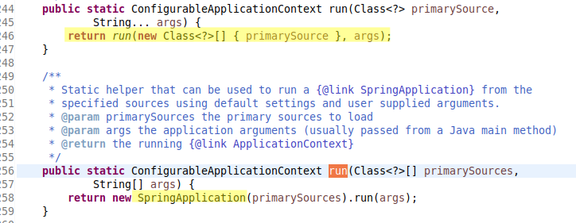
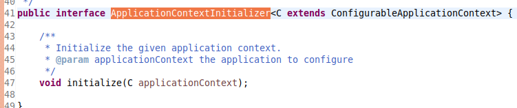

> 源码分析

1. 跟踪启动类的源码

首先在启动类中查看`SpringApplication.run()`方法的源码

可确定`run()`方法实际上创建了`SpringApplication`的实例.

2. 跟踪 SpringApplication 的构造器

查看`SpringApplication`的构造器

先查看`setInitializers()`方法,可知封装的是一个集合容器,存储的数据也是执行时传递的参数,可确定`跟踪错误`,故跳到上一节点,查看其传递的方法参数.

链式方法调用传递的`ApplicationContextInitializer`类型是个接口,因是非运行时的源码跟踪,故`跟踪错误`,跳回上一节点.

接着查看下`setInitializers((Collection) getSpringFactoriesInstances(ApplicationContextInitializer.class));`中的`getSpringFactoriesInstances()`方法.阅读源码,定位到`loadFactoryNames()`方法.

阅读`loadFactoryNames()`的源码,定位一个常量`FACTORIES_RESOURCE_LOCATION`,可确定此常量在此方法中起到不可或缺的作用.

查看`FACTORIES_RESOURCE_LOCATION`常量值

根据注释的提示,查看`spring.factories`的源文件.

由此可确定 springboot 是通过加载`spring.factories`源文件来实现自动化配置的.(截图为源文件部分内容)

> 配置原理文字小结

- `SpringFactoriesLoader`加载指定的配置文件;
- `SpringApplication`初始化自动化的配置(init),并启动容器(run);

以下是简单的结构图 :  

