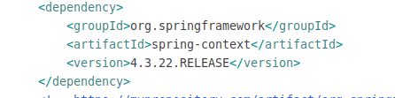
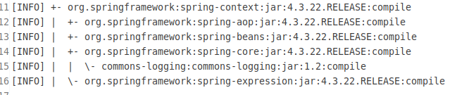

#### 简称的定义

在本笔记中,以后对 `springframework` 进行简化标记,标记为 `sf`.

#### 基本测试 jar 包的依赖

- 在 maven 如何配置最基础的引用?

若是仅仅需要使用`sf`的`ioc`,`aop`,`el`,`resource`的模块功能,只需要在 maven 的依赖文件中,引入`spring-context`的依赖即可.  
依赖文件如下,本测试环境使用的是 4.3.22 :  

- spring-context 的依赖传递性会加入哪些 jar 包?

以下截图是使用`mcn dependency:list`指令查看依赖性的传递关系的.  
  
由上面的截图可知,`spring-context`依赖以下 4 个 jar 包 :  
`spring-aop`  
`spring-beans`  
`spring-core`  
`spring-expression`  
而`spring-core`又依赖`commons-loggings`jar 包.  
由此,可得出,仅使用`sf`的 ioc,aop,el,resources 模块,仅需添加`spring-context`的依赖即可.  
需要注意的是,此版本为 4.x 的版本,在之前的版本,这种方式未必行得通.
