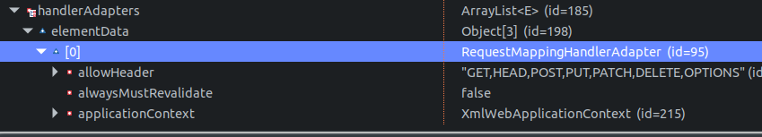

参考 :  
`LocalValidatorFactoryBean`  
- 同时实现了spring和JSR303的`Validator`接口  
- 如何使用?在`application.xml`中配置`bean`标签  
- 配置时,id或name标识推荐为`validator`  

驱动器 :  
- `<mvc:annotation-driven />`自动注册一个默认的`LocalValidatorFactoryBean`组件  
- spring本身没有提供`JSR303`的实现,需要手动添加,推荐`hibernate-validator`  

断点 ：  
  
定位 ：  
  
变量 ：  
  
  
  
  
  
总结 ：  

