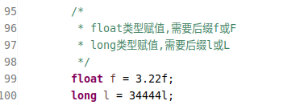
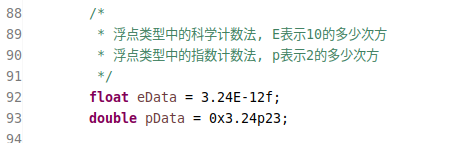

#### 需要后缀的

因 java 的自动类型转换机制,在整型和浮点类型中都有默认的类型,一般情况下,都会自动的将数值类型转换为默认的类型.

因此在声明 long 类型的时候,应当后缀 l 或 L.在声明 float 类型的时候,应当后缀 f 或 F.

#### 需要前缀的

赋值十六进制的数据时,应前缀 0x;八进制的数据时,应前缀 0,因易造成混淆,不推荐使用.

jdk1.7 的时候支持二进制赋值方式,前缀 0b;以及数字字面量下划线.

#### 特殊计算方式的

在赋值浮点数的时候,因 java 位运算的原因,占用了符号`^`,故使用字母`E`表示科学计数法.表示 10 的多少次方.

jdk1.5 开始,支持十六进制的指数表示方式,使用字母`p`.其基数是 2,而不是 10.

