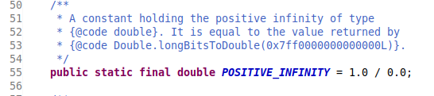
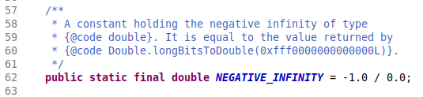
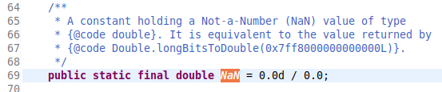
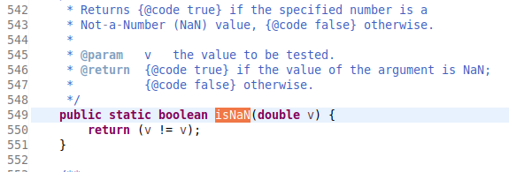

#### 如何处理浮点类型的特殊值

**三种特殊的数值**  
截图以`java.lang.Double`类源码为例.

- 正无穷大  
  
- 负无穷大  
  
- NaN(不是一个数值)  
  

**如何判断三种特殊的值**

- 不要使用包装类中内置的常量,进行对等的判断,使用运算符`==`.
- 在 java 中,所有的'非数值',都被认为是不同的,即`if(x == Double.NaN)`得到的永远都是 false.
- 应当使用对应包装类中的方法进行判断.  
  
