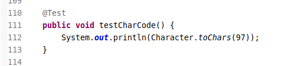
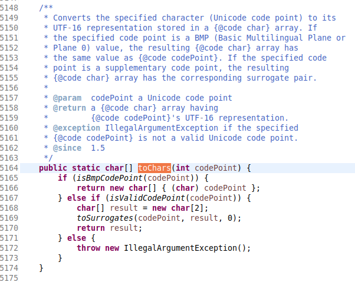

java 使用 16bit 的 unicode 编码来表示单个字符.

> char 类型中支持的转义字符

`\u` : 表示 unicode 代码单元的编码
`\b` : 退格符
`\t` : 制表符
`\n` : 换行符
`\r` : 回车符
`\"` : 双引号
`\'` : 单引号
`\\` : 反斜杠

> 如何正确的使用转义字符\\u

在单字符赋值的时候,使用转义字符`\u`,要注意其进制的规定,在 java 中规定其使用方式是十六进制的.故 char 类型的取值范围可以表示为`\u0000 ~ \uffff`.

```java
// 赋值的时候必须占4位
char ch = '\u0097';
```

> 什么是代码点

代码点的定义 :  
指的是字符编码中,某个字符对应的代码值.  
  
任意截取相关概念的方法源码  

