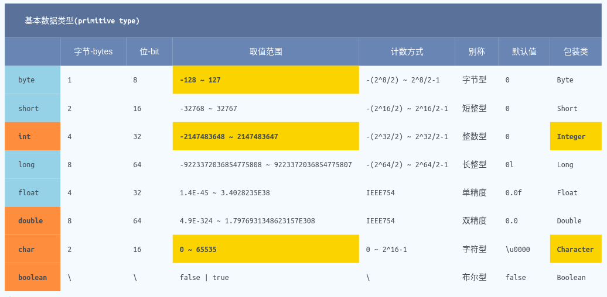

#### 数据类型的分类

#### 原始类型数据

java 是强类型语言,也就是说对于每一个变量都要声明一种类型.总计有 8 种基本类型,英文释义 `primitive type`;有 4 种用来表示整数类型,2 种用来表示浮点类型,1 种用来表示 unicode 字符类型,1 种用来表示逻辑真假的布尔类型.

以下是基本类型对比的统计表格  

| 类型    | 字节数 | 默认值 | 别称   |
| ------- | ------ | ------ | ------ |
| byte    | 1      | 0      | 字节型 |
| short   | 2      | 0      | 短整型 |
| int     | 4      | 0      | 整数型 |
| long    | 8      | 0l     | 长整型 |
| float   | 4      | 0.0f   | 单精度 |
| double  | 8      | 0.0    | 双精度 |
| char    | 2      | 空格 0 | 字符型 |
| boolean | \\     | false  | 布尔型 |

> 整型类型的数据比对

**byte 类型**  
(1) 默认值是 0  
(2) 占用 1 个字节(bytes),8 位  
(3) 取值范围是 : -127 ~ 128 或者是 `-(2^8/2) ~ 2^8/2-1`  
(4) 别称字节型数据,也就是 1byte = 8 bit

**short 类型**  
(1) 默认值是 0  
(2) 占用 2 个字节,16 位  
(3) 取值范围 : `-(2^16/2) ~ 2^16/2-1`  
(4) 别称短整型数据

**int 类型(`默认推荐`)**  
(1) 默认值是 0  
(2) 占用 4 个字节,32 位  
(3) 取值范围 : `-(2^32/2) ~ 2^32/2-1` 或者是 正负 21 亿多  
(4) int 是整数型数据的默认类型,因 java 的自动类型转换机制,故其他整型类型的数据都会默认的转换为 int 类型.  
(5) 赋值十六进制的数据时,需要前缀`0x`,如 : `int num = 0x00fff`  
(6) 赋值八进制的数据时,需要前缀`0`,如 : `int num = 07777`,但是此种前缀方式容易造成混淆,故不推荐使用.  
(7) 从 jdk1.7 开始,支持二进制数据的赋值,即前缀`0b`,如 : `int num = 0b0101010`;在长度较长的数字字面量赋值的时候,可以使用符号'\_'来优化代码的阅读性,如 : `int num = 1_000_000_000_000`.

**long 类型**  
(1) 默认值是 0  
(2) 占用 8 个字节,64 位  
(3) 取值范围是 : `-(2^64/2) ~ 2^64/2-1`  
(4) 别称长整型数据  
(5) 在数据赋值的时候应当后缀字符 l 或 L,如 : `long num = 100000l`.

> 浮点类型数据比对

**float 类型**  
(1) 默认值是 0.0f 或 0.0F  
(2) 占用 4 个字节  
(3) 取值范围 : 遵循 IEEE754 规范  
(4) 赋值的时候应当后缀字符 f 或 F

**double 类型(`默认推荐`)**  
(1) 默认值是 0.0  
(2) 占用 8 个字节  
(3) 取值范围 : 遵循 IEEE754 规范  
(4) 是浮点类型中的默认类型,也就是说,因自动转换类型的机制,float 类型的数据会自动的转换为 double 类型.

**浮点类型数据的特殊赋值方法**  
(1) 科学计数法  
通常科学计数法采用符号'^'来表示,比如 10^12 表示的是 10 的 12 次方.但是在 java 语言中,符号'^'涉及到了位运算,即异或运算.故不能使用这种表示方式.  
在浮点数的定义中,关于科学计数法可以使用符号`E`来表示.比如`double num = 3.44E12`,表示的就是 3.44 乘以 10 的 12 次方.  
(2) 指数表示法  
在 jdk1.5 中,可以使用十六进制表示浮点数值.比如,0.125 可以表示为`0x1.0p-3`.  
在十六进制表示法中,使用字符 p 表示指数.指数采用的是十进制,且其基数是 2.

**IEEE754 规范的三个特殊值**  
正无穷大  
负无穷大  
NaN(不是一个数字)

**NaN 类型的对等判断**  
包装类型 Double 中,内置了几个常用的静态常量,其中有`Double.NaN`,在进行 NaN 类型的对等判断的时候,是不能直接使用符号'=='与常量`Double.NaN`进行判断.  
因为在 java 中,所有的'非数值'的值都被认为是不相等的.  
若是采用`if(x == Double.NaN)`的方式进行判断,这个逻辑结果永远都是 false.  
应当使用包装类型 Double 的方法 isNaN()进行判断.如`if(Double.isNaN(x))`,这样才会达到预期的效果.

> 其他类型

**char 字符类型**  
(1) 16 位的 unicode 单字符  
(2) 取值范围是 : 0 ~ 65535  
(3) 声明赋值的时候,一定要使用单引号进行引用,如`char ch = 'a'`而不能使用双引号,如`char ch = "a"`

**特殊的转义序列符**  
(1) 在 char 类型中,可以使用符号'\u'来表示 unicode 代码单元,比如`\u97`表示的是英文字母`a`

**boolean 布尔类型**  
(1) 只有两个值,一个是 true,一个是 false  
(2) 常用于逻辑关系的判断处理中  
(3) 注意!在 java 中,布尔类型的数据不能和整型类型的数据互相转换的,这样会报出编译错误.
